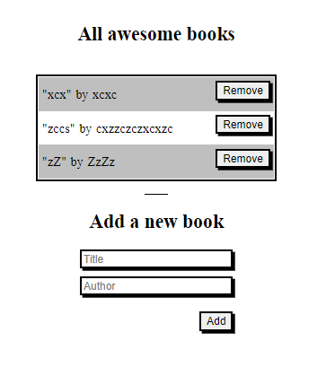

# Awesome-Book

This my Capstone Project in the Microverse curriculum.

## Built With

- HTML
- CSS
- GitHub

## Live Demo

[Live Demo Link](https://aburayhaan.github.io/Awesome-Book/)

## Getting Started

To get a local copy up and running:

1. Clone this repository or download the Zip folder:

**``git clone https://aburayhaan.github.io/Awesome-Book/``**

1. Navigate to the location of the folder in your machine:

**``you@your-Pc-name:~$ cd <folder>``**

## Author

👤 **Hammed Adisa**

- Github: [@AbuRayhaan](https://github.com/AbuRayhaan)

- LinkedIn: [Adisa Hammed](https://www.linkedin.com/in/hammed-adisa-mct-ccsp-ctp-b4378372/)

👤 **Ogaga Iyara**

- Github: [@Ogaga1](https://github.com/Ogaga01)

- LinkedIn: [Ogaga Iyara](https://www.linkedin.com/in/ogaga-iyara-0339b0105/)

## Contributing

Contributions, issues, and feature requests are welcome!

## Show your support

Give a ⭐ if you like this project and how we manage to build it!

## 📝 License

This project is [MIT](https://github.com/AbuRayhaan/Awesome-Book/blob/add-license-1/LICENSE)

